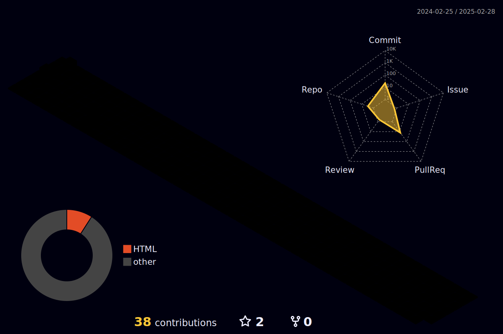

### Hi there 👋

<!--
**Elig-Arsee/Elig-Arsee** is a ✨ _special_ ✨ repository because its `README.md` (this file) appears on your GitHub profile.

Here are some ideas to get you started:

- 🔭 I’m currently working on ...
- 🌱 I’m currently learning ...
- 👯 I’m looking to collaborate on ...
- 🤔 I’m looking for help with ...
- 💬 Ask me about ...
- 📫 How to reach me: ...
- 😄 Pronouns: ...
- ⚡ Fun fact: ...
-->


<div>
  <a href="https://github.com/Elig-Arsee">
    
  </a>
  <a href="https://github.com/Elig-Arsee">
    
  </a>
</div>


  <p>
    
    
    
    
    
    <br/>
    
    
  </p>

<p>
  📣 Besoin de me contacter ? Retrouvez-moi ici :<br/>
  <a href="mailto:arse.eligc@gmail.com?subject=[GitHub]%20🔥%20Contato&body=Olá%20Elig%2C%0A%0AEu%20encontrei%20seu%20perfil%20no%20GitHub%20e%20..."></a>
  <a href="https://linkedin.com/in/elig-arse/"></a>
</p>



<details>
  <summary>Quelques statistiques ...</summary><br/>

<!--START_SECTION:waka-->


**🐱 My GitHub Data** 

> 📦 2.5 MB Used in GitHub's Storage 
 > 
> 🏆 12 Contributions in the Year 2024
 > 
> 💼 Opted to Hire
 > 
> 📜 41 Public Repositories 
 > 
> 🔑 10 Private Repositories 
 > 
**I'm an Early 🐤** 

```text
🌞 Morning                1342 commits        ██░░░░░░░░░░░░░░░░░░░░░░░   06.24 % 
🌆 Daytime                11769 commits       ██████████████░░░░░░░░░░░   54.69 % 
🌃 Evening                7494 commits        █████████░░░░░░░░░░░░░░░░   34.83 % 
🌙 Night                  914 commits         █░░░░░░░░░░░░░░░░░░░░░░░░   04.25 % 
```
📅 **I'm Most Productive on Monday** 

```text
Monday                   4446 commits        █████░░░░░░░░░░░░░░░░░░░░   20.66 % 
Tuesday                  4106 commits        █████░░░░░░░░░░░░░░░░░░░░   19.08 % 
Wednesday                4267 commits        █████░░░░░░░░░░░░░░░░░░░░   19.83 % 
Thursday                 2907 commits        ███░░░░░░░░░░░░░░░░░░░░░░   13.51 % 
Friday                   2751 commits        ███░░░░░░░░░░░░░░░░░░░░░░   12.78 % 
Saturday                 1758 commits        ██░░░░░░░░░░░░░░░░░░░░░░░   08.17 % 
Sunday                   1284 commits        █░░░░░░░░░░░░░░░░░░░░░░░░   05.97 % 
```


📊 **This Week I Spent My Time On** 

```text
🕑︎ Time Zone: Europe/Paris

💬 Programming Languages: 
Other                    3 hrs 56 mins       ████████████████████░░░░░   78.62 % 
Vue.js                   46 mins             ████░░░░░░░░░░░░░░░░░░░░░   15.47 % 
TypeScript               16 mins             █░░░░░░░░░░░░░░░░░░░░░░░░   05.43 % 
sh                       1 min               ░░░░░░░░░░░░░░░░░░░░░░░░░   00.48 % 

🔥 Editors: 
Chrome                   3 hrs 56 mins       ████████████████████░░░░░   78.62 % 
VS Code                  1 hr 2 mins         █████░░░░░░░░░░░░░░░░░░░░   20.90 % 
Zsh                      1 min               ░░░░░░░░░░░░░░░░░░░░░░░░░   00.48 % 

💻 Operating System: 
Windows                  3 hrs 56 mins       ████████████████████░░░░░   78.62 % 
WSL                      1 hr 4 mins         █████░░░░░░░░░░░░░░░░░░░░   21.38 % 
```


```


 Last Updated on 03/05/2024 00:05:21 UTC
<!--END_SECTION:waka-->
</details>
